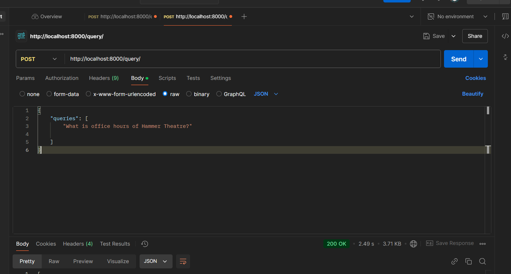

### Install requirements

`pip install -r requirements.txt`

### Add mongoDb key in .env file

### Run webserver

`uvicorn main:app --reload`

## Now test Api endpoints in FastApi

POST TYPE API Endpoint: `http://127.0.0.1:8000/query  `

body: row/json
`{
    "queries":[
          "what is office hourse of hammer theatre?"
    ]
}`

response format:
```[
    {
        "query": "what is office hourse of hammer theatre?",
        "success": true,
        "result": {
            "input": "what is office hourse of hammer theatre?",
            "context": [
                {
                    "id": null,
                    "metadata": {
                        "source": "https://events.sjsu.edu/",
                        "title": "SJSU Events Calendar - SJSU Events Calendar",
                        "language": "en"
                    },
                    "page_content": ", Nov 15, 2024 7:30 pm to 9:30 pm Hammer Theatre, Sobrato Art Exhibition & Performances Music and Dance Register I'm Interested Share SJSU School of Music and Department of Film and Theatre present: CABARET Share SJSU School of Music and Department of Film and Theatre present: CABARET on Facebook Share SJSU School of Music and Department of Film and Theatre present: CABARET on Twitter Share SJSU School of Music and Department of Film and Theatre present: CABARET on LinkedIn Adobe Acrobat AI Assistant - Workshop on using Acrobat AI Assistant Wed, Nov 20",
                    "type": "Document"
                },
                {
                    "id": null,
                    "metadata": {
                        "source": "https://hammertheatre.com/",
                        "title": "Hammer Theatre Center",
                        "language": "en-US"
                    },
                    "page_content": ". Get your tickets now to attend this unforgettable event. Buy tickets for Miss Iran 2583! NEWSLETTER + BROCHURE SIGN UP Sign Up Looking for a way to contribute? Your support is vital to assist us in bringing the finest local, national and internationally recognized artists and acts to our stage as well as funding important educational initiatives that serve both SJSU students and local K-12 schools. Thank you for embracing our programming and sharing your love of live performances with those closest to you. We hope you will consider supporting by making a gift of any amount of your choosing. Donate Here A LOOK BACK Watch highlights from previous events and performances. Hammer Theatre 101 Paseo de San Antonio (between 2nd and 3rd Street) Downtown San José BOX OFFICE FALL SEMESTER BOX OFFICE HOURS Aug 27 – Dec 20 Tuesday through Friday 1PM-5PM Open one hour before most showtimes. Closed the week of Nov 25 (408) 924-8512 hammertheatre-tickets@sjsu",
                    "type": "Document"
                },
                {
                    "id": null,
                    "metadata": {
                        "source": "https://hammertheatre.com/",
                        "title": "Hammer Theatre Center",
                        "language": "en-US"
                    },
                    "page_content": ". Get your tickets now to attend this unforgettable event. Buy tickets for Miss Iran 2583! NEWSLETTER + BROCHURE SIGN UP Sign Up Looking for a way to contribute? Your support is vital to assist us in bringing the finest local, national and internationally recognized artists and acts to our stage as well as funding important educational initiatives that serve both SJSU students and local K-12 schools. Thank you for embracing our programming and sharing your love of live performances with those closest to you. We hope you will consider supporting by making a gift of any amount of your choosing. Donate Here A LOOK BACK Watch highlights from previous events and performances. Hammer Theatre 101 Paseo de San Antonio (between 2nd and 3rd Street) Downtown San José BOX OFFICE FALL SEMESTER BOX OFFICE HOURS Aug 27 – Dec 20 Tuesday through Friday 1PM-5PM Open one hour before most showtimes. Closed the week of Nov 25 (408) 924-8512 hammertheatre-tickets@sjsu",
                    "type": "Document"
                }
            ],
            "answer": "According to the provided context, the office hours of the Hammer Theatre are:\n\n* Tuesday through Friday: 1PM-5PM\n* Open one hour before most showtimes\n* Closed the week of Nov 25\n\nAdditionally, the box office phone number is (408) 924-8512 and the email is hammertheatre-tickets@sjsu.edu.\n\nNote that these hours are only valid for the Fall semester, which is specified as August 27 to December 20."
        },
        "error": null
    }
]```


