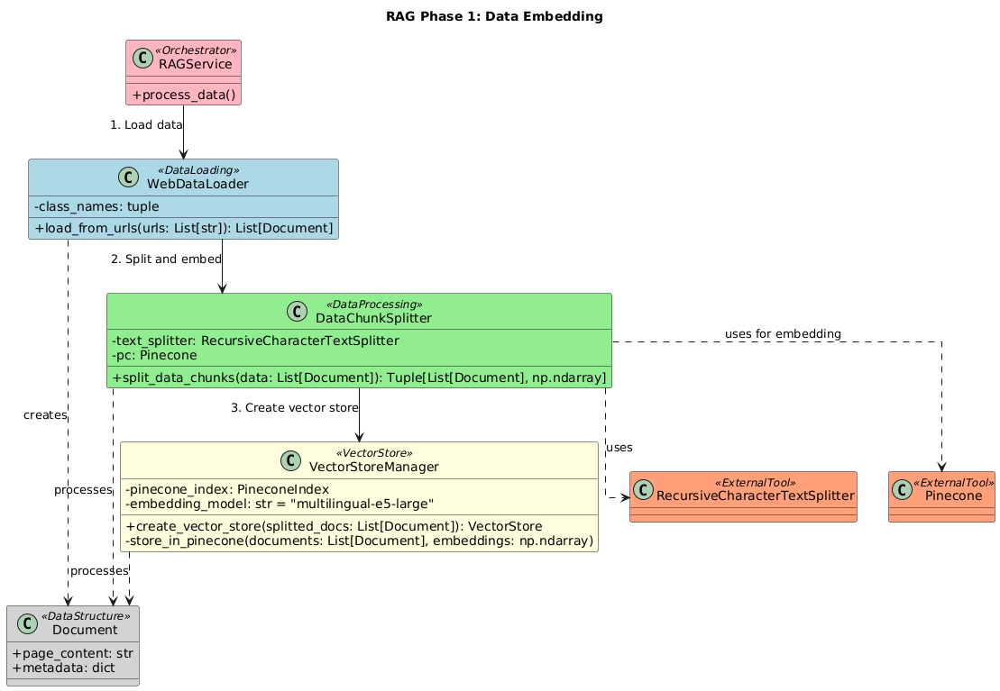
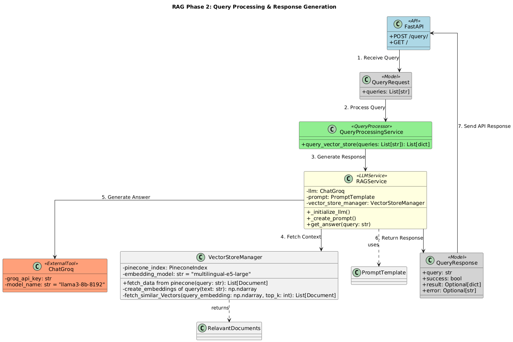
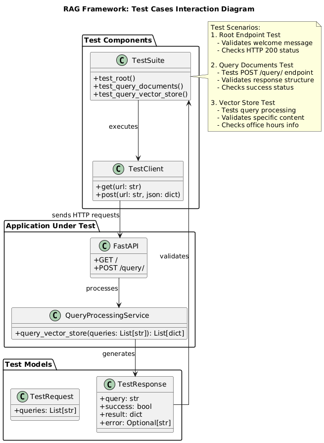
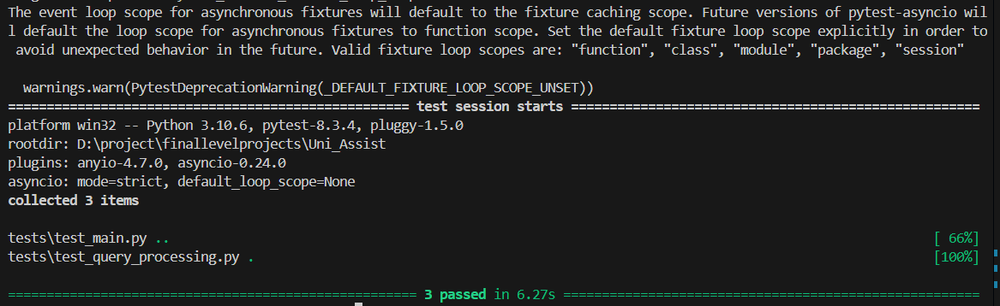

# InsightBot: NLP Powered AI ChatBot

## Overview

**InsightBot** is an advanced AI-powered chatbot designed to enhance the student experience by providing real-time assistance with university-related inquiries. From academics to campus events and administrative services, InsightBot centralizes information and reduces response times, ensuring a seamless and personalized user experience.

---

## 🌟 Team : Synergy

- **Soumya Bharathi Vetukuri**
- **Rutuja Patil**
- **Shubham Kothiya**
- **Mann Nada**

### **Together, we aim to revolutionize the student experience through AI-driven solutions!**

---
## 🎯 Objectives  

### What InsightBot Brings to the Table:  
- 🌟 **Instant Assistance**: Real-time responses to queries about academics, campus events, fees, and more.  
- 📚 **Centralized Information**: A one-stop solution for all university-related inquiries, no more navigating multiple platforms.  
- ⏱️ **Improved Efficiency**: Simplified processes for scheduling, payments, and exam-related queries.  
- 🎯 **Personalized Support**: AI-powered recommendations for resources, events, and opportunities tailored just for you.  
- 🎉 **Enhanced Experience**: Focus on learning and living while InsightBot takes care of the rest!  

---

## ✨ Key Features  

- **⚡ Real-Time Assistance**: Instant responses to course schedules, fees, and other FAQs.  
- **🔍 Centralized Information**: Say goodbye to platform-hopping for answers!  
- **🎁 Personalized Recommendations**: Suggestions tailored to your academic and extracurricular interests.  
- **📈 Productivity Boost**: Simplified student processes for a better university experience.  
- **📅 Google Calendar Integration**: One-click event scheduling with your calendar.

---


---

## 🏗️ High-Level Architecture  

### 1. **User Authentication**  
- Login options: **Credentials** or **Google OAuth-based SSO**.  

### 2. **User Interface**  
- **Chatbot Design**: Clean and user-friendly interface.  
  - 🛠️ **Features**:
    - HTTP POST requests via Axios to interact with FastAPI backend.
    - Real-time AI-generated responses.
    - A dedicated **Google Calendar button** for event scheduling.  

### 3. **FastAPI Backend**  
- **High-Performance API Framework**:  
  - Handles communication between the UI and server.  
  - Features automatic validation, type inference, and built-in API docs.  

### 4. **Server-Side RAG (Retrieval-Augmented Generation)**  
- Combines **language models** and **retrieval systems** to provide accurate responses.  
  - 🔎 **Steps**:  
    1. **Information Retrieval**: Searches databases and external resources.  
    2. **Pre-Processing**: Cleans and structures retrieved data.
     <br> 
    
     <br>
     
    3. **Integration**: Delivers precise responses using advanced AI models.  
     <br>
    

    
### 5. **Database**  
- Powered by **MongoDB Cluster** and **Pinecone** for fast, efficient information retrieval.  

### 6. **CI/CD Pipeline**  
- **Automation Tools**:  
  - **GitHub** for code repository.  
  - **Jenkins** for integration and deployment.  
  - Deployed on **AWS-hosted Ubuntu servers**.  

---

## Test Cases & Results

The InsightBot project includes comprehensive functional tests to ensure the reliability and correctness of its components. 

 

### Test Cases
1. **Root Endpoint Test**  
   - **Description**: Validates the root endpoint to ensure the API responds with the expected welcome message and HTTP 200 status.

2. **Query Documents Test**  
   - **Description**: Tests the `/query/` endpoint to validate response structure, HTTP status, and successful query processing.

3. **Vector Store Test**  
   - **Description**: Evaluates the `query_vector_store()` function by verifying query processing, result accuracy, and specific content, such as office hours information.

### Test Results
All test cases passed successfully, demonstrating the stability and reliability of the InsightBot API and its underlying services. 
- Below is a screenshot of the test results:
<br>
<br>



### Running Tests
To run the tests, use the following command:
```bash
pytest
```


---
## 💡 Technology Stack  

| **Component**       | **Technology**           |  
|----------------------|--------------------------|  
| **Frontend**         | React, Axios             |  
| **Backend**          | FastAPI (Python)         |  
| **Database**         | MongoDB, Pinecone        |  
| **CI/CD**            | GitHub, Jenkins, AWS     |  
| **AI Framework**     | Retrieval-Augmented Generation (RAG) |  

---

## 🎥 Demo  

👀 **Coming Soon!** Experience InsightBot in action and see how it transforms student life.  

---

## ⚙️ How to Run InsightBot  

Follow these steps to get started:  

1. **📥 Install Requirements** 
   Install the necessary Python packages by running:  
   ```
   pip install -r requirements.txt 
   ```

2. **Configure MongoDB**
Add your MongoDB connection key to the .env file.

3. **Run the Webserver**
Start the webserver using the following command:
```
uvicorn main:app --reload
```

4. **Test API Endpoints**
Use the FastAPI interface to test the chatbot functionality.

Endpoint:
```
POST http://127.0.0.1:8000/query
```
Request Body (JSON):
```
{
  "queries": ["what is office hours of hammer theatre?"]
}
```


